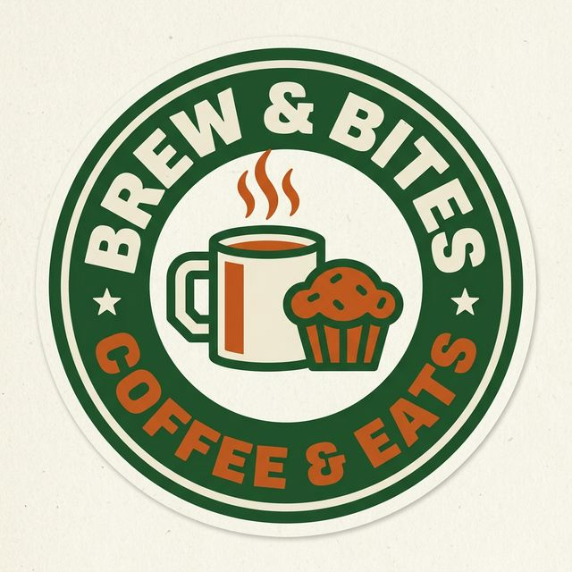

# ☕ Brew & Bites - QR Dine-In Ordering SPA

<div align="center">
  
  
  <p>
    
    
    
    
    
  </p>

  <p><strong>"Sip, Chill, & Vibe"</strong></p>
  
  <p>A modern, lightweight, and mobile-first Single-Page Application (SPA) designed specifically for coffee shops with a <strong>Street Vintage 1999-2000</strong> aesthetic. Customers can scan a QR code from their table, browse an interactive menu, customize orders, and checkout seamlessly—all directly from their smartphones.</p>

  <p>Built entirely with <strong>Vanilla HTML5, CSS3, and JavaScript (ES6+)</strong>. No heavy frameworks (like React or Vue) are required, making it blazing fast and 100% ready for deployment on GitHub Pages or any static hosting service.</p>
</div>

---

## ✨ Key Features

- **📱 Mobile-First Retro UI/UX:** A pristine *Street Vintage 1999-2000* design (`#f4edde` Muted Cream background, `#1e592f` Forest Green accents, blocky shadow buttons) optimized for seamless mobile viewing.
- **🔳 Table QR Session Locking:** Dynamically generated unique QR codes for each table. Upon scanning, the customer's session is locked to their specific table.
- **📸 High-Quality Aesthetic Catalog:** A categorized menu (Coffee, Non-Coffee, Snacks) featuring high-quality, concept-accurate, vintage product photography.
- **⚙️ Advanced Order Customization:** Quick-select chips (e.g., *Less Sugar, Extra Ice, Hot*) and custom text notes allow customers to personalize every order.
- **🛒 Smart Cart Engine:** Automatically groups identical items with matching customization notes, calculates accurate subtotals, and applies dynamic PB1 Tax (10%).
- **💳 Multi-Payment Integration UI:** Support for modern standard payment modalities such as QRIS (GoPay, OVO, ShopeePay, M-Banking) and Cash at the Cashier.
- **🧾 Thermal Digital Receipt:** Generates a dynamic, print-ready virtual thermal receipt containing the Order ID, customized item lines, table number, and total calculation.

## 🛠️ Tech Stack & Philosophy

We believe in keeping things fast, simple, and dependency-free for local businesses.
- **HTML5:** Semantic tag architecture.
- **CSS3:** Native CSS variables, Flexbox/Grid layouts, and custom retro animations (e.g., skeleton blinking).
- **Vanilla JavaScript:** Pure, modular architectural pattern for state management and DOM manipulation.
- **QRCode.js:** A robust and lightweight client-side QR generation library.
- **Google Fonts & FontsAwesome:** Clean, modern typography using *Poppins* mixed with expressive iconography.

## 📁 Repository Architecture

```text
📦 Coffeeshop QR
 ┣ 📂 assets
 ┃ ┣ 📂 img                   # All visual product assets and vintage photos
 ┃ ┃ ┣ 📜 vintage_logo.png    # Primary brand logo
 ┃ ┃ ┣ 📜 espresso.png        # Product photography
 ┃ ┃ ┗ ...
 ┃ ┗ 📂 QR                    # Rendered 500x500 Table QR Code outputs for printing
 ┣ 📂 css
 ┃ ┗ 📜 style.css             # Main stylesheet (Retro theme variables, Modals, Responsive logic)
 ┣ 📂 js
 ┃ ┣ 📜 cart-engine.js        # Logic for cart array state, grouping, and PB1 grand totals
 ┃ ┣ 📜 database.js           # Static internal database arrays (Products and Tables config)
 ┃ ┣ 📜 main.js               # Application initialization and global event listeners
 ┃ ┣ 📜 payment-handler.js    # Checkout UI flow and Thermal Receipt HTML generation
 ┃ ┣ 📜 qr-logic.js           # Menu Routing rules and QR Code generator simulator
 ┃ ┗ 📜 render-ui.js          # Core UI rendering and DOM manipulation
 ┣ 📜 index.html              # The SPA Entry Point
 ┗ 📜 README.md               # Documentation
```

## 🚀 Getting Started

Since this project has absolutely no backend or build-step dependencies (No Node.js, Webpack, or npm needed), deploying or running it locally is incredibly straightforward.

1. **Clone the repository:**
   ```bash
   git clone https://github.com/your-username/coffeeshop-qr.git
   ```
2. **Launch the App:**
   Simply open `index.html` in your favorite web browser on your desktop, or launch it with a local development server like VS Code's *Live Server* extension.
3. **Simulate a Table Scan:**
   By default, opening the `index.html` base URL redirects you to the "QR Simulator" Landing Page. Clicking any of the simulated Table QR Codes will inject the `?table=tx` URL parameter and drop you directly into the active ordering catalog.

### 🖨️ Printing the QR Codes for Tables
High-quality, pre-generated 500x500 PNG QR Codes are already available in the `assets/QR/` directory. You can immediately print them and place them on your tables.

<div align="center">
  <table>
    <tr>
      <td align="center"><br><em>Meja 01</em></td>
      <td align="center"><br><em>Meja 02</em></td>
      <td align="center"><br><em>Meja 03</em></td>
    </tr>
  </table>
</div>

## 🎨 Theme & Design System

The application utilizes a *Street Vintage 1999-2000* aesthetic that feels premium yet nostalgic. It implements thick solid borders, deep shadow offsets, and legible contrast.

- **Background Base (Muted Cream):** `#f4edde`
- **Cards/Surface (White):** `#ffffff`
- **Primary Borders & Text (Forest Green):** `#1e592f`
- **Call-to-Action Accent (Burnt Orange):** `#d45d25`
- **Global Typography:** *Poppins*

## 📝 License

This project is open-source and freely available under the terms of the MIT License. Feel free to fork, customize, and deploy for your own cafe.
