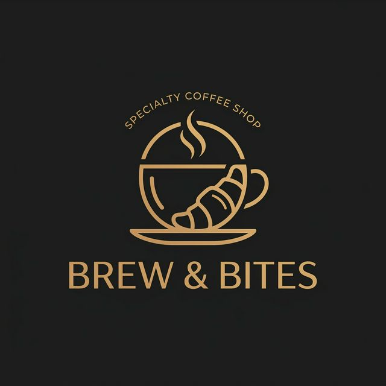

# ☕ Brew & Bites - QR Dine-In Ordering SPA



A modern, elegant, and mobile-first Single-Page Application (SPA) designed specifically for coffee shops and cafes. This system allows dine-in customers to scan a QR code from their table, browse the interactive menu, customize their orders, and seamlessly checkout directly from their smartphones.

Built entirely with **Vanilla JavaScript, HTML5, dan CSS3**—no heavy frameworks required. Blazing fast, lightweight, and 100% ready for deployment on GitHub Pages or any static hosting.

---

## ✨ Key Features

- **📱 Mobile-First UI/UX:** A pristine, dark-themed elegant design (`#181818` background, `#d4a373` gold accents) optimized for seamless mobile viewing.
- **🔳 Table QR Session Locking:** Automatically generates unique QR codes for each table. Upon scanning, the customer's session is locked to that specific table.
- **🛍️ Interactive Product Catalog:** Categorized menu (Coffee & Snacks) powered by an internal array database.
- **⚙️ Advanced Order Customization:** Customers can add specific requests utilizing quick-select chips (e.g., *Less Sugar, Extra Ice, Hot*) and custom text notes.
- **🛒 Smart Cart Engine:** Automatically groups identical items with identical combinations of notes, calculating subtotals and applying dynamic PB1 Tax (10%).
- **💳 Multi-Payment Integration UI:** Let customers select from standard payment methods such as QRIS, Bank Transfer, E-Wallet, or Cash.
- **🧾 Thermal Digital Receipt:** Generates a dynamic, print-ready virtual thermal receipt containing an Order QR/Barcode, input for the Customer's Name, table number, and detailed customization notes.

## 🛠️ Tech Stack

- **HTML5:** Semantic architecture.
- **CSS3:** Native CSS variables, Flexbox, Grid layouts, and smooth keyframe transitions.
- **Vanilla JavaScript (ES6+):** Pure, modular JavaScript architecture (No React/Vue required).
- **QRCode.js:** Lightweight library for client-side QR generation.
- **FontAwesome & Google Fonts:** Clean, modern typography using *Poppins*.

## 📁 File Architecture

```text
📦 Coffeeshop QR
 ┣ 📂 css
 ┃ ┗ 📜 style.css             # Main stylesheet (Dark Theme, Modals, Responsive)
 ┣ 📂 img
 ┃ ┗ 📜 logo.png              # App branding logo
 ┣ 📂 js
 ┃ ┣ 📜 cart-engine.js        # Logic for cart arrays, grouping, and grand totals
 ┃ ┣ 📜 database.js           # Static database config for Products and Tables
 ┃ ┣ 📜 main.js               # App Initialization and Event handling
 ┃ ┣ 📜 payment-handler.js    # Checkout flow and Thermal Receipt HTML generation
 ┃ ┣ 📜 qr-logic.js           # Menu Routing and QR simulator
 ┃ ┗ 📜 render-ui.js          # DOM Manipulation and View switching logic
 ┣ 📜 index.html              # The SPA Entry Point
 ┗ 📜 README.md               # Documentation
```

## 🚀 Getting Started

Since this project has absolutely no backend or build-step dependencies, running it is incredibly straightforward.

1. **Clone the repository:**
   ```bash
   git clone https://github.com/your-username/coffeeshop-qr.git
   ```
2. **Launch the App:**
   Simply open `index.html` in your favorite web browser, or launch it with a local development server like VS Code's *Live Server* extension.
3. **Simulate a Table Scan:**
   By default, opening `index.html` (without URL parameters) redirects to the "QR Simulator" Landing Page. Clicking any of the Table QR Codes will inject the `?table=t1` URL parameter and drop you directly into the active ordering interface.

## 🎨 Design System

The application utilizes a dark "Specialty Coffee" aesthetic that ensures low eye strain and premium feel:
- **Background Base:** `#181818`
- **Cards/Surface:** `#242424`
- **Primary Accent:** `#d4a373`
- **Typography:** *Poppins*

## 📝 License

This project is open-source and available under the terms of the MIT License.
